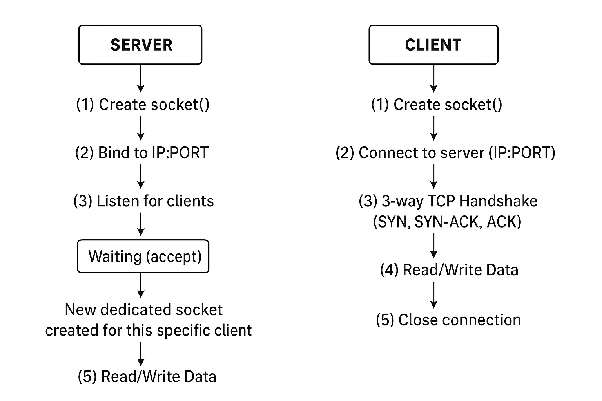

# Sockets Explained

At their core, **sockets** are an abstraction provided by operating systems to enable communication between different processes — either on the same machine or over a network.  

They act as **endpoints in a two-way communication channel**.  

When two machines or two applications need to talk to each other over the internet or a local network, each side of that communication will create a socket.  

A socket is essentially a software construct that wraps a combination of:  
- a **protocol** (TCP or UDP),  
- an **IP address**, and  
- a **port number**.  

The operating system uses this combination to **route messages appropriately**.

👉 You can think of it like a **telephone**:  
- A socket is the **phone**,  
- The IP address and port together are like the **phone number and extension**,  
- Both parties must “dial” correctly to establish a connection.

---

## Sockets in the OSI Model

The **OSI model** is a conceptual framework for how network systems communicate.  

- Sockets operate primarily at the **Transport Layer (Layer 4)**.  
- The **Application Layer (Layer 7)** (e.g., a web browser or backend service) calls the **Socket API** to send or receive data.  
- The socket then wraps the data into **TCP or UDP segments**, adds headers, and sends it to the **Network Layer (Layer 3)** for IP routing.  

Thus, sockets provide a **clean interface** between application logic and the underlying network stack — shielding developers from complexities like:  
- routing,  
- packet fragmentation,  
- retransmission, etc.

---

## Types of Sockets

### 1. **TCP (Transmission Control Protocol) Sockets**
- **Connection-oriented**.  
- Provide **reliable, ordered, and error-checked** data transmission.  
- Establishes connections using a **three-way handshake** (`SYN`, `SYN-ACK`, `ACK`).  
- Guarantees packets arrive in order and without duplication.  
- **Use cases**: web browsing, file transfer, database access.  

### 2. **UDP (User Datagram Protocol) Sockets**
- **Connectionless** and **unreliable**.  
- Simply sends datagrams without a handshake.  
- No guarantee of delivery, order, or integrity.  
- Very **fast and lightweight**.  
- **Use cases**: real-time video/audio streaming, gaming, VoIP.  

---

## Server-Side Lifecycle of Sockets

On the server side, sockets follow a specific lifecycle:

1. **Listening Socket**  
   - Created and bound to a specific IP + port.  
   - Waits for incoming connections (does not communicate itself).  

2. **Accepting Connections**  
   - When a client connects, the server **accepts** it.  
   - A **new socket instance** is created for that specific client.  
   - The original socket keeps listening for more connections.  

3. **Communication**  
   - The dedicated client socket is used for read/write operations.  
   - This allows servers to handle **multiple clients concurrently**.

---

## Concurrency Models

- **Synchronous model**  
  - Each client handled by a **separate thread/process**.  
  - Simple but inefficient for many connections (threads consume memory + context switching overhead).  

- **Event-driven model (non-blocking I/O)**  
  - One thread (or a small pool) can manage **thousands of sockets**.  
  - Uses system calls:  
    - `select`, `poll`  
    - `epoll` (Linux), `kqueue` (BSD/MacOS)  
  - Only notified when a socket is **ready** for I/O.  
  - Greatly reduces CPU usage and latency.  
  - Basis of high-performance frameworks like **nginx**, **Node.js**, **asyncio**.  

---

## Client-Side Perspective

- The client creates a socket and connects to the server’s IP + port.  
- For TCP, this triggers the **three-way handshake**.  
- Once connected, the client can **read from and write to the socket**, much like working with a file.  

👉 In Unix-like systems, **sockets are treated as file descriptors**.  

---

## File Descriptors & Socket Descriptors

- When the OS opens a file, it creates an **entry** in the kernel to track it.  
- Each open file is represented by an **integer ID** → the **file descriptor (FD)**.  
- Example: If a process has 10 files open, it will have 10 entries like `3, 4, 5, ...`.  

Similarly:  
- When you open a socket, it’s represented by a **socket descriptor** (also just an integer).  
- Both **files and sockets** can use the same system calls: `read`, `write`, `close`.  

---

## Closing Sockets

- Both client and server are expected to **close sockets** after use.  
- Prevents **resource leaks** and **memory exhaustion**.  
- Improperly closed sockets on busy servers can lead to resource exhaustion and failures.  

## *Here you see the logical diagram :* 
-----

